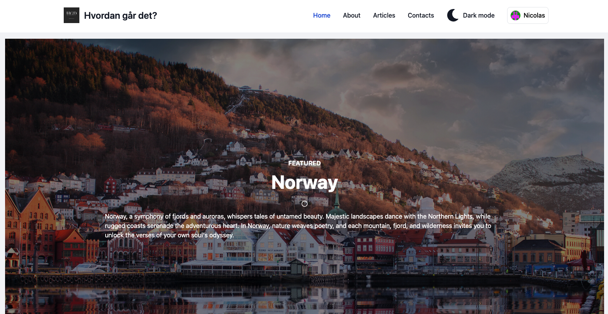
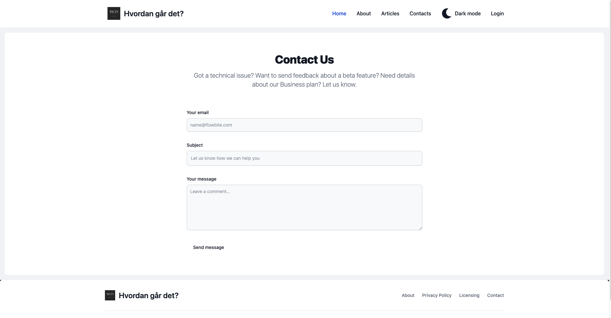
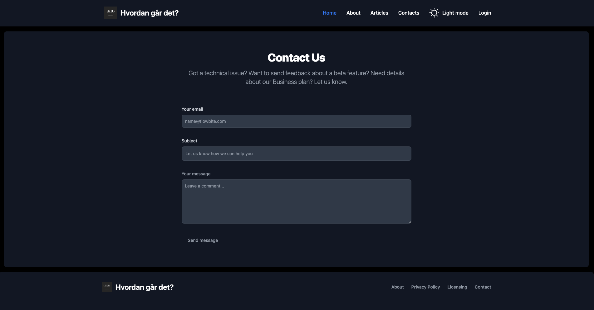
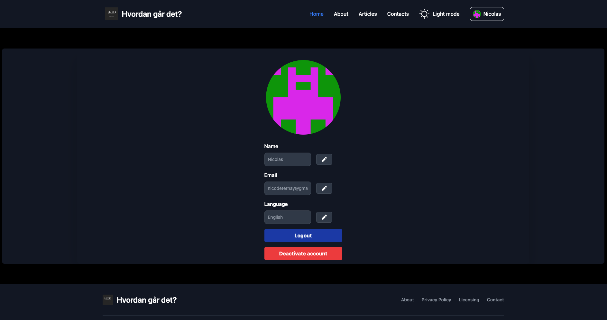

# WebTech Project 

## Introduction

This is the WebTech project of Nicolas D'Aviau de Ternay, Aymeric Moulet, and Fredrik Sarai. It's a simple web application using next.js and supabase.

## Getting Started (2 ways)

## 1) Access website 
Click here to access the webpage: https://ece-webtech-2023-fall-gr01-08.vercel.app/

## 2) Locally
To run this project locally, follow these steps:

1. Clone this repository to your local machine:

   ```bash
   git clone https://github.com/NicolasDaviau/WebTech-project-Nicolas-Aymeric-Fredrik.git

2. Navigate to the project directory:

   ```bash
   cd WebTech-project-Nicolas-Aymeric-Fredrik
   ```

3. Install the project dependencies:

   ```bash
   npm install
   npm install react-icons 
   npm install gravatar
   ```

4. Start the server:

   To run the project, you have two options: using  `npm run dev` 

## Recommended use
1) Choose the theme you want



2) Create a user. If you don not have an account, a gravatar will be generated for you 

3) Navigate between articles and enjoy the magic of Norway

## Features

User Authentication: Implemented OAuth2 with GitHub ✅
Content Management: Users can create and publish posts.🟧
Navigation and Accessibility: Intuitive interface for easy navigation.✅
User Profile Customization: Users can manage and personalize their profiles.✅

## Deployment
Vercel  Domaine : ece-webtech-2023-fall-gr01-08.vercel.app
Supabase Project URL : https://nrqrwnrbmzbkkjrojady.supabase.co

## Self-Evaluation

Overall Grade
Grade: 16.5/20
Comments: We are proud of our project, although we are aware some features could be added. If we had more time, we would make sure the comment-section worked properly. We would also enable editing of your own posts. Also we´d give each post an entire-screen display - just like you see in a blog.

Project Structure
Grade: 16/20
Comments: We respected the overall instructions and the frameworks structures. 

Naming Convention
Grade: 15/20
Comments: We tried our best to respect the naming conventions, though we know we made some mistakes.

Front-End (Estetic)
Grade: 18/20
Comments:  We think the website is beautiful and has an even greater potential. We´re giving ourselves 18/20 because the posts need some work and we could also apply some final touches overall. We spend a lot of time on Tailwind CSS to create a beautiful and dynamic interface.

Back-End 16/20 
Comments: There are some back-end features we didn't manage to implement due to the time constraint.

Final note: Fredrik had some trouble with his GitHub, so he programmed through Aymeric and Nicolas´ screen and sent them code through Messenger. His code doesn´t show in the commit history for this reason. 


## Authors
- Nicolas D'Aviau de Ternay
- Aymeric Moulet
- Fredrik Sarai
  
# WebTech
